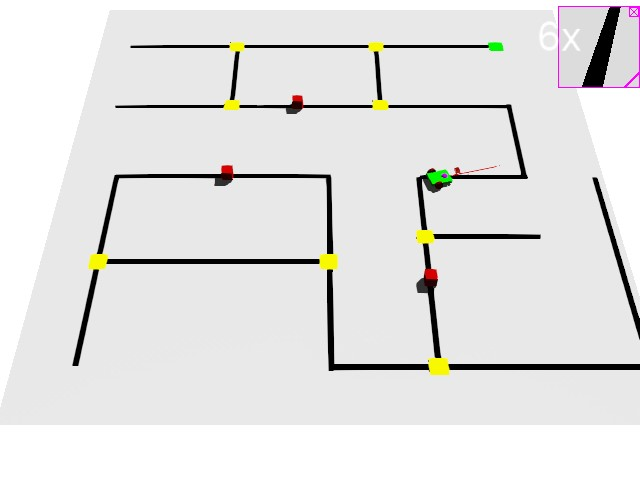

# Line-inspection-maze  
　　This is a project that uses vision to track lines out of the maze, including simple obstacle avoidance. 
The simulation is implemented in [**Webots**](https://cyberbotics.com/). It is implemented in C language and runs on Win10 by default.  

